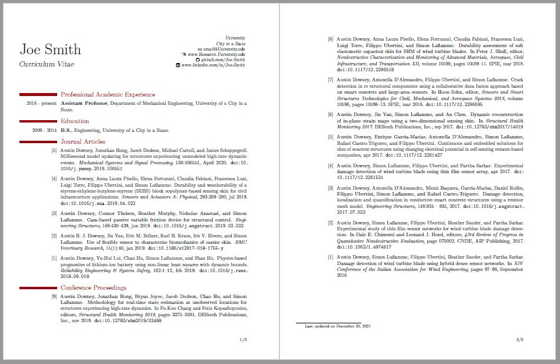

# Academic-CV-with-BibTeX
Development of an Academic CV developed around BibTeX which allows for the listing of all publication on the CV from a single .bib file. 

The CV output looks like this:

To get it to compile it is a 3 step process
1. Build and compile (F5 in TexStudio) to generate the .aux file.
1. Run bibtex (F8 or Tools>Commands>BibTeX in TexStudio).
1. Build and compile (F5 in TexStudio) to generate the PDF.

This work is licensed under a Creative Commons Attribution-ShareAlike 4.0 International License.

